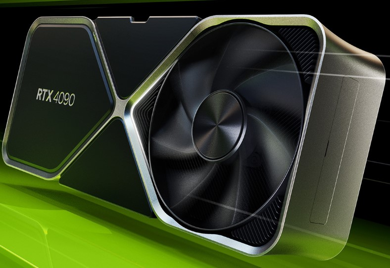
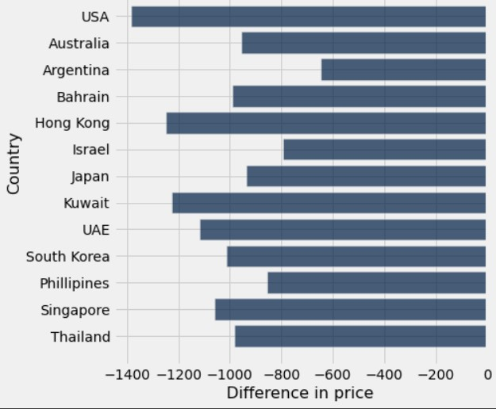
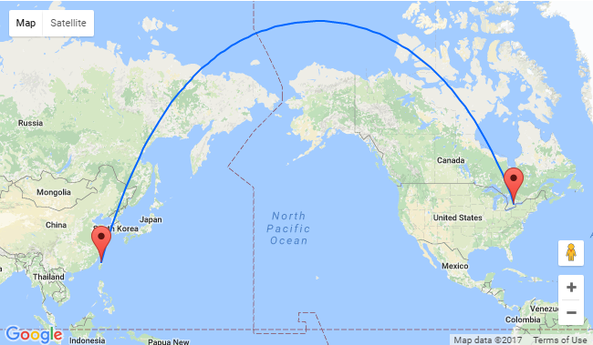
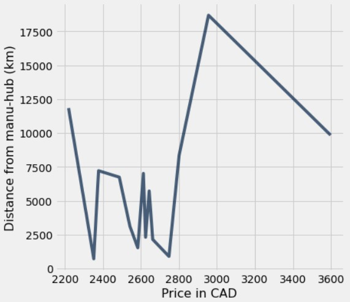

## RTX 4090 Index

The reason I picked the RTX 4090 as my commodity is because I wanted to build a PC using it as a component and figured this assignment would help me decide if I should source the GPU from Canada or if I should buy it when I go back home to the UAE for holiday

Now to get pricing data from different countries, Nvidia isn't a central vendor like Apple is and a lot of the prices of the GPUs in different countries are decided by third party vendors and as such there is no pricing table you can scrape off their website. I resorted to pulling the price of the GPU off newegg while changing my country of residency manually. I found newegg the most reliable source as Amazon has people selling it for almost 3 times MRP in some countries.

After converting all the prices from the local currencies to Canadian dollars using the CurrencyScoop API, and graphing the differences in price, somewhat of a pattern seemed to be present but there were a few outliers present that could not be explained.

Analyzing the difference in price compared to Canada, I theorized that maybe Canada had such a high price because of the large shipping distance from the manufacturing hubs of the GPU (based mainly in China and Taiwan).

I ran the correlation function to find out if there was a correlation between the distance between the countries and the manufacturing hub and the price of the GPU however, the correlation coefficient was below 0.5 which would mean this factor wasn't exactly the main deciding factor of the price.

Thinking about it in retrospect I think there is a more complex factor at play like the economy of each country and the strength of the currency or the impact of something like the global semiconductor shortage. Of course there also is the possibility that shipping routes are handled differently and are a mix of land and sea routes. Maybe for Canada the GPU's are shipped to the US first and driven to Canada which would hike the price considerably as cargo ships are extremely cost efficient while cargo trucks are not.

